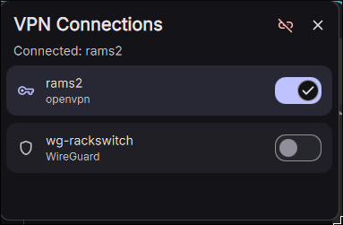

# VPN Control

A [DankMaterialShell](https://github.com/AvengeMedia/DankMaterialShell) bar widget for connecting and disconnecting
NetworkManager VPNs — OpenVPN, WireGuard, and anything else NetworkManager can dial — without leaving the bar.




## Features

- Bar pill shows the **active VPN's name** at a glance, or "VPN off" when nothing is up (`rams2 +1` when several are connected)
- **Left-click** opens a popout listing every VPN profile with a toggle each, plus a one-click "Disconnect all"
- **Right-click** is a quick toggle: reconnects the last VPN you used, or drops every active VPN
- Also available as a **Control Center tile** with the same quick toggle
- Built on DMS's own network backend (`DMSNetworkService`), so **password and OTP prompts** use the normal DMS credentials dialog
- Fully event-driven — no polling, no `nmcli` process per refresh
- Per-profile status: connecting, connected, or the actual NetworkManager error if a tunnel fails
- WireGuard profiles are labelled separately from plugin-based VPNs (OpenVPN, OpenConnect, …)

## Installation

### Manually

```bash
cd ~/.config/DankMaterialShell/plugins
git clone https://github.com/schneipp/dms-plugin-vpn-control VpnControl
```

Then in DMS Settings → Plugins, click "Scan for Plugins" and enable **VPN Control**. Add it to a bar section from
Settings → DankBar.

### Via DMS CLI (once available in the registry)

```bash
dms plugins install vpnControl
```

## Usage

- **Left-click** the bar widget for the list of VPN profiles; click a row or its toggle to connect/disconnect.
- **Right-click** the bar widget to quick-toggle: connects the last-used VPN, or disconnects everything if a VPN is active.
- Click the **unlink icon** in the popout header to disconnect all active VPNs at once.
- While a connection is in flight the whole list dims and the pill icon fades, so it's obvious DMS is busy.

## Settings

- **Show connection name** — label next to the bar icon (default on; turn off for an icon-only pill)
- **Bar icon** — `Key`, `Shield`, or `Globe`. Globe matches the icon DMS's Control Center button already uses, so the
  default is Key to keep the two apart.
- **One VPN at a time** — connecting a VPN disconnects any other active one (default on; turn off if you run split
  tunnels or a corporate VPN alongside WireGuard)
- **Right-click action** — quick toggle, or nothing

## Requirements

- DankMaterialShell ≥ 1.6.0 with the `dms` server running (it provides the network backend this plugin talks to)
- NetworkManager, with your VPNs configured as NM connections

Add profiles in DMS Settings → Network → VPN, or from the shell:

```bash
nmcli connection import type openvpn file ~/lab.ovpn
nmcli connection import type wireguard file /etc/wireguard/wg0.conf
```

Tunnels that NetworkManager does **not** manage — a raw `wg-quick` interface, Tailscale, an `openvpn` process started by
hand — won't appear here, because the plugin lists NetworkManager connection profiles.

## License

MIT
